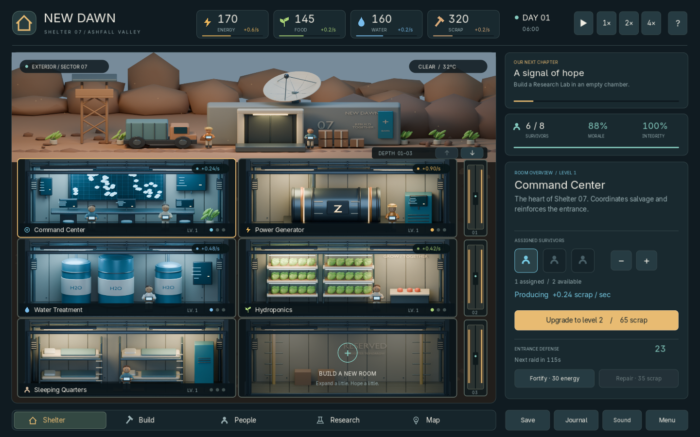

# New Dawn — Shelter 07

A playable bunker survival management prototype inspired by the four supplied reference images: desert entrance, stacked cutaway rooms, cyan control screens, amber utility lighting, construction, and raider defense.

**Play:** double-click `Play New Dawn.cmd`, or `build/Windows/NewDawn.exe`. Keep the `.pck` beside the executable. The build includes a Godot runtime, so players do not need to install an engine.



## The game

Restore the long-range relay and survive until day 7. Maintain food, water, energy, scrap, morale, and shelter integrity. Assign survivors, build into ten chambers across five floors, upgrade rooms, scavenge three destinations, recruit survivors, research technologies, and prepare for periodic raids. A successful rescue and shelter failure both have ending screens.

Nine room types: Command Center, Power Generator, Water Treatment, Hydroponics, Sleeping Quarters, Research Lab, Workshop, Security Room, and Medical Bay. Construction takes 14 game seconds; rooms support three upgrade levels. New rooms require staffing, except bedrooms. Six survivors begin with four assigned and two available.

One day is 90 game seconds. A successful run lasts about nine minutes at normal speed, or a little over two minutes at 4×. The initial shelter is sustainable, allowing time to learn. A full legal progression to victory is covered by the simulation tests.

## Controls

| Control | Action |
|---|---|
| Click | Select rooms and use action buttons |
| Wheel / depth arrows | View deeper floors |
| Space | Pause/resume |
| 1 / 2 / 3 | 1× / 2× / 4× speed |
| B / P / R / M | Build / People / Research / Map |
| S | Save |
| Escape | Help / close overlay |
| F11 | Fullscreen |

Use the `?` button for an in-game tutorial, Journal for event history, and Menu for save/load or a new shelter. Autosave runs every 20 seconds and on close. Saves use Godot's `user://shelter_07.json` location. The game does not simulate offline resource consumption.

## Agent play with the GUI open

See [the agent play guide](docs/AGENT_PLAY.md) and [AGENTS.md](AGENTS.md). The visible game now exposes live JSON and semantic controls through a local file bridge; a PowerShell CLI controls that same simulation.

```powershell
.\tools\agent.ps1 launch
.\tools\agent.ps1 status -Full
.\tools\agent.ps1 actions
.\tools\agent.ps1 build -Room 5 -Kind lab
.\tools\agent.ps1 step -Seconds 15
.\tools\agent.ps1 assign -Room 5 -Delta 1
.\tools\agent.ps1 screenshot
```

New CLI launches are paused. `status` includes a live heartbeat, session identity, resources, rates, staffing, timers, objective, GUI state, and currently legal actions. Commands apply normal game rules and update the GUI. The bridge works while paused, without network access or screen scraping. Use `Agent Play.cmd` for a double-click launch, or launch normally and attach the CLI. For isolated tests, pass a unique `-BridgeDir` and `launch -Isolated`; this keeps a separate save.

The same guide and CLI are included in the Windows package. Actual agent play should keep the GUI visible; headless runs are for software tests only.

## Project and art

- `project.godot`: open in Godot, then press F5 to play.
- `scripts/simulation.gd`: UI-independent simulation, validation and save model.
- `scripts/main.gd`: custom drawn interface, input, save I/O, effects and generated UI audio.
- `art/New_Dawn.blend`: editable Blender file containing eleven module scenes, with meshes, cameras, materials and lighting. Select a scene using Blender's Scene selector.
- `art/build_assets.py`: deterministic procedural asset generator.
- `assets/renders/`: ten room/construction images and the exterior render actually used by Godot.
- `tests/test_simulation.gd`: staffing, economy, research, raids, saves, win/loss and progression checks.
- `tools/build.ps1`: rebuild, test and package locally.

The pipeline is 2.5D: Blender renders original 3D module scenes to PNGs; Godot composes them into an interactive management game. The reference images guide the composition and palette and are not used as gameplay backgrounds. Characters in the room artwork are static miniatures; interactive staffing is shown by room indicators and the inspector. The prototype does not include free-roaming 3D control, rigged character animation, multiplayer, monetization, or a mobile export.

## Rebuild

Validated locally with **Blender 5.2.0 LTS**, **Godot 4.7.2**, and OpenGL compatibility rendering on an RTX 2060. The game itself requires no network services or API keys.

```powershell
# Re-import assets, test and package with installed tools.
.\tools\build.ps1

# Also recreate every Blender asset and the editable .blend file.
.\tools\build.ps1 -Render

# Also play a full campaign through the CLI in an isolated GUI session.
.\tools\build.ps1 -AgentGuiTest

# Override tool locations on another computer.
.\tools\build.ps1 -Godot 'C:\Tools\Godot_console.exe' -Blender 'C:\Blender\blender.exe' -Render
```

Standalone render invocation:

```powershell
& 'D:\Program Files\Blender Foundation\Blender 5.2\blender.exe' --background --python-exit-code 1 --python art/build_assets.py
```

`-- --quick` reduces render samples. `-- --only power` rerenders only the power PNG; run a full build to refresh the combined `.blend`. The generator uses Cycles with OptiX when available, with CPU fallback. Blender is deliberately excluded from Godot's import scan by `art/.gdignore`; the game uses the finished PNGs.

Export templates were not installed on this machine. The supplied Windows package therefore pairs the game PCK with the installed editor-capable Godot runtime, renamed `NewDawn.exe`. It launches directly into the game; the tradeoff is a larger runtime (about 181 MB). With matching Godot export templates installed, the supplied Windows Desktop preset can produce a smaller release executable through the editor or `--export-release`.

## Validation

- 47 simulation checks, including an entire legal seven-day rescue run and a shortage-driven defeat.
- Godot input tests click the actual viewport through room selection, construction, staffing, tab navigation and research.
- Every tab and modal renders in the UI smoke test.
- Real disk save/load, replacement and corrupt-save recovery.
- Agent protocol validation, JSON numbers, legal action parity, retries, stale sessions, GUI screenshots, and a complete rescue campaign driven through the CLI.
- Native OpenGL screenshot inspection and launch of the packaged executable.

Test commands are included in `tools/build.ps1`; logs and screenshots are written under `build/`. The original references remain in the project root and are excluded from the game pack.

## Asset notices

Models, renders, interface graphics and click audio were generated for this project. Inter was copied from the local Blender distribution; its SIL Open Font License is in `docs/third_party/Inter-OFL.txt`. Godot and bundled component notices are in `docs/third_party/Godot.txt` and are included beside the playable build.
